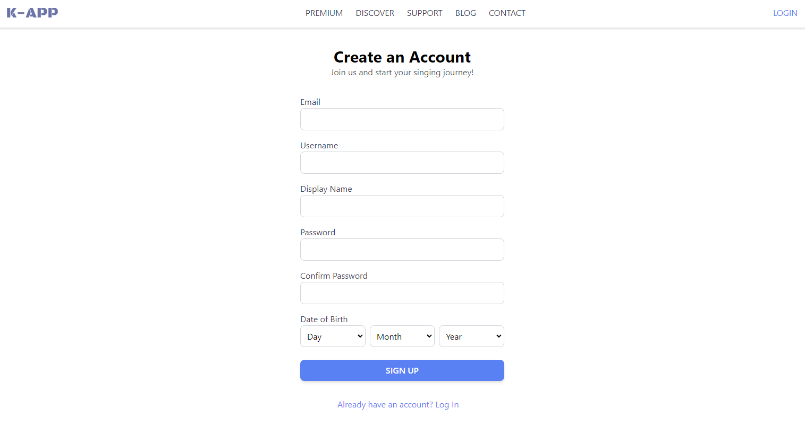
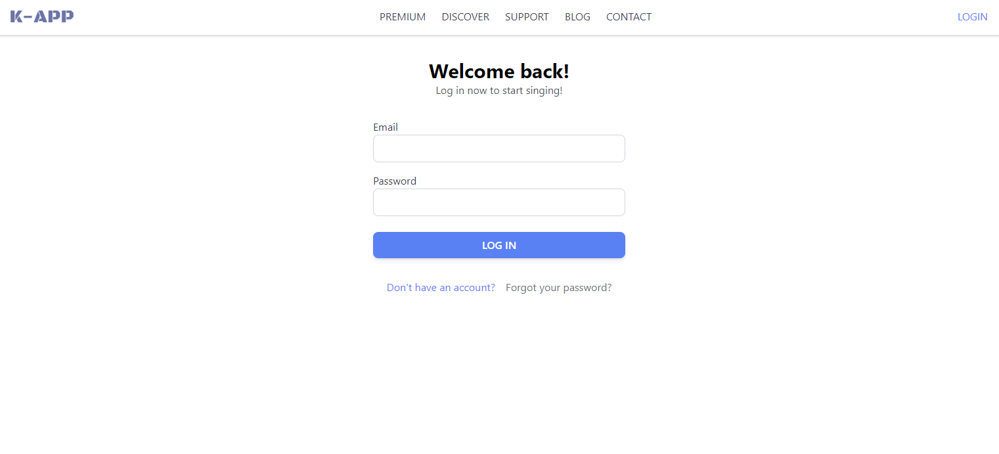
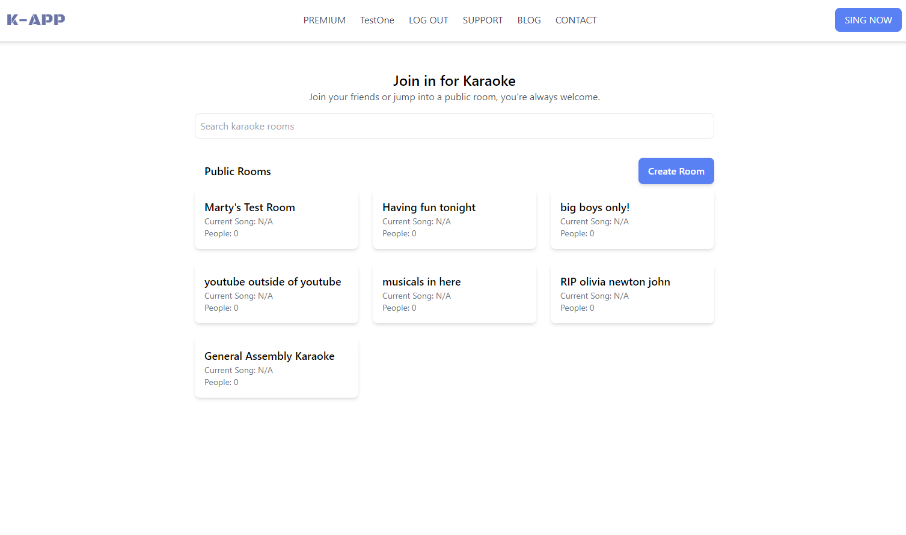
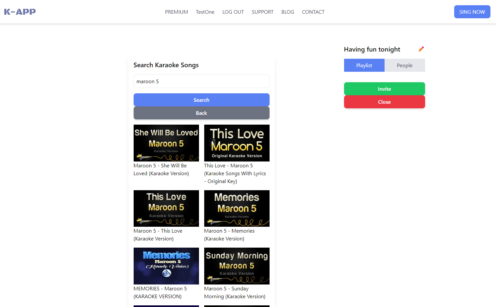
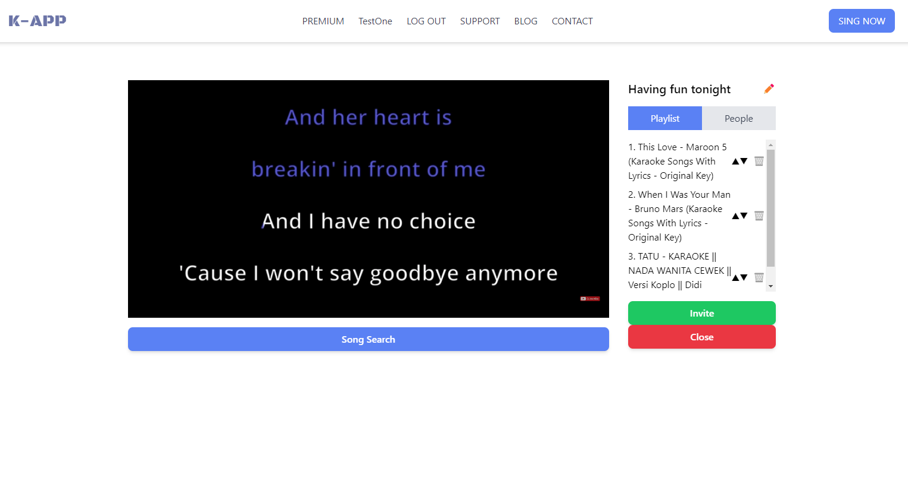

# Virtual Karaoke React Project
## General Assembly Unit 4
Virtual Karaoke App is a full-stack, single-page application that allows users to create and join karaoke rooms to sing and enjoy music together. Users can search for karaoke videos from YouTube, create playlists, and collaborate in real-time with other participants. 

### Getting Started
- [Excalidraw/Wireframe Link](https://excalidraw.com/#json=25L44Yh_9prZXKbKMal9t,B-PmS5LGWvpSW0lHuD_rjg)
- [Trello Link](https://trello.com/b/sYblvuOq/virtual-karaoke-react)
- [Render Link for App](https://virtual-karaoke-react.onrender.com)

### Screenshots

### Technologies Used
- **MongoDB**: Database management
- **Express**: Backend framework
- **React**: Frontend library
- **Node**: JavaScript runtime environment
- **Socket.IO**: Real-time, bi-directional communication between the client and server
- **Tailwind CSS**: Intuitive implementation of CSS
- **JWT (JSON Web Tokens)**: Token-based authentication
- **YouTube Data API**: Integration for searching karaoke videos

## Next Steps
### Planned Future Enhancements
- **Host Features**: UI specific to a karaoke room's host to control the users who have joined. Kick and promote functionality.
- **Persistent Playlist**: Have the songs on the playlist persist through different sessions.
- **Voice Chat Integration**: Implement real-time voice chat directly within the app without the need for third-party services like Discord.
- **Mobile Optimization**: Enhance the user experience on mobile devices by implementing responsive design patterns.